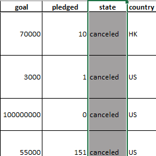
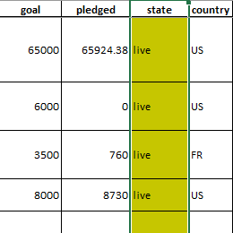
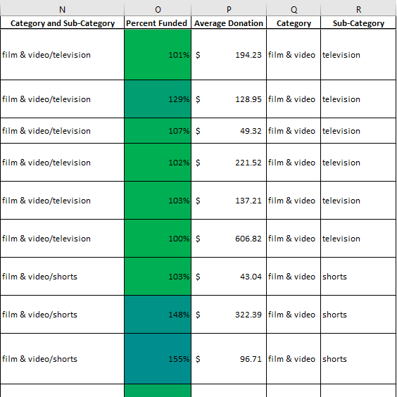

  

## Summary

Over $2 billion has been raised using the massively successful crowdfunding service, Kickstarter, but not every project has found success. Of the more than 300,000 projects launched on Kickstarter, only a third have made it through the funding process with a positive outcome.

Getting funded on Kickstarter requires meeting or exceeding the project's initial goal, so many organizations spend months looking through past projects in an attempt to discover some trick for finding success. I will organize and analyze a database of 4,000 past projects in order to uncover any hidden trends.

## Conditional Formatting and Column Creation

Using the Excel table provided, I modified and analyzed the data of 4,000 past Kickstarter projects as I attempt to uncover some market trends.

   
   
   
   

I used conditional formatting to fill each cell in the `state` column with a different color, depending on whether the associated campaign was successful, failed, or canceled, or is currently live.

  
  
  
  
  

I created a new column O called `Percent Funded` that uses a formula to uncover how much money a campaign made to reach its initial goal. After that, I used conditional formatting to fill each cell in the `Percent Funded` column using a three-color scale. The scale starts at 0 as a dark shade of red, transitioning to green at 100, and blue at 200.

  
  

I created a new column P called `Average Donation` that uses a formula to uncover how much each backer for the project paid on average.

  
  
  

I created two new columns, one called `Category` at Q and another called `Sub-Category` at R, which use formulas to split the `Category` and `Sub-Category` column into two parts.

## Pivot Tables and Stacked Column Charts

Using the modified data of the Kickstarter projects, I will use pivot tables and pivot charts with the newly created columns to further my attempt to uncover some market trends.

  

I created a new sheet with a pivot table that analyzed my initial worksheet to count how many campaigns were successful, failed, canceled, or are currently live per **category**. I then created a stacked column pivot chart that's able to be filtered by country based on the table created.

  

I created a new sheet with a pivot table that analyzed my initial worksheet to count how many campaigns were successful, failed, or canceled, or are currently live per **sub-category**. I then created a stacked column pivot chart that can be filtered by country and parent-category based on the table created.

  

The dates stored within the `deadline` and `launched_at` columns use Unix timestamps. Fortunately, [this formula](https://www.extendoffice.com/documents/excel/2473-excel-timestamp-to-date.html) can be used to convert these timestamps to a normal date. I created a new column S called `Date Created Conversion` that will convert the data contained within `launched_at` into Excel's date format. After that, I created a new column T called `Date Ended Conversion` that will convert the data contained within `deadline` into Excel's date format.

  

## Pivot Tables and Line Graphs

I created a new sheet with a pivot table with a column of `state`, rows of `Date Created Conversion`, values based on the count of `state`, and filters based on `Category` and `Date Created Conversion (Year)`. After that, I created a pivot chart line graph that visualizes this new table.

## Outcomes

Using the modified data of the Kickstarter projects, I will create new columns and charts to display the outcomes of my findings in an attempt to uncover some market trends.

I created a new sheet with 8 columns:
  * `Goal`
  * `Number Successful`
  * `Number Failed`
  * `Number Canceled`
  * `Total Projects`
  * `Percentage Successful`
  * `Percentage Failed`
  * `Percentage Canceled` 

In the `Goal` column, I created 12 rows with the following headers:

  * Less than 1000
  * 1000 to 4999
  * 5000 to 9999
  * 10000 to 14999
  * 15000 to 19999
  * 20000 to 24999
  * 25000 to 29999
  * 30000 to 34999
  * 35000 to 39999
  * 40000 to 44999
  * 45000 to 49999
  * Greater than or equal to 50000

  

Using the `COUNTIFS()` formula, I counted how many successful, failed, and canceled projects were created with goals within the ranges listed above. With that, I populated the `Number Successful`, `Number Failed` and `Number Canceled` columns with this data.

I then added up each of the values in the `Number Successful`, `Number Failed` and `Number Canceled` columns to populate the `Total Projects` column. Then, using a mathematical formula, I found the `Percentage Successful`, `Percentage Failed` and `Percentage Canceled` for the projects per goal range.

Once completed, I created a line chart that graphs the relationship between a goal's amount and its chances at success, failure, or cancellation.

## Statistical Analysis

If one were to describe a successful crowdfunding campaign, most people would use the number of campaign backers as a metric of success. One of the most efficient ways to characterize a quantitative metric, such as the number of campaign backers, is by creating a summary statistics table.

  

I created a new worksheet in my workbook and created a column for the number of backers of successful campaigns and unsuccessful campaigns. With that information, I was able to evaluate the `Mean`, `Median`, `Minimum`, `Maximum`, `Variance` and `Standard Deviation` for successful and unsuccessful campaigns.

## Written Report

Conclusions we can draw about Kickstarter campaigns from the data given:
* Theater is the most successful category for projects
* Technology has similar numbers for successful, failed and canceled projects
* All of the “journalism” projects were canceled before they started
* There are a small number of live campaigns
* Plays were the most frequented and most successful sub-category for projects
* For the month of May, successful campaigns created during that month where at its peak
* From the months of May through September, successful campaigns created during these months decreased from month to month
* For the month of December, successful campaigns created during that month fell below the number of failed campaigns
* Canceled projects stay at a consistent amount throughout the year 

Limitations of the dataset:
* The data set only takes reports from 20 countries
* The data set pulls from a certain number of years (2009 - 2017)
* With the stacked graphs, it is harder to see the total amounts for each state when multiple are stacked

Mean/ Median Data Summary:
* Based on the data, when comparing the two against one another, the median summarizes the data more meaningfully. When reviewing the data, the range of the data set is a large spread which means that the larger numbers tend to make the mean become more lopsided. If the data had a more normal distribution, the mean would probably be better suited to summarize the information.

Variability between campaigns and why it makes sense:
* Based on the data, there is more variability with successful campaigns. This makes sense because the range of data for successful campaigns are larger and because more outliers are present in the data set.